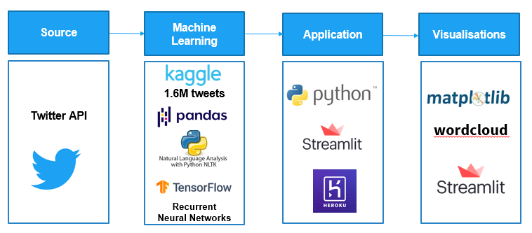
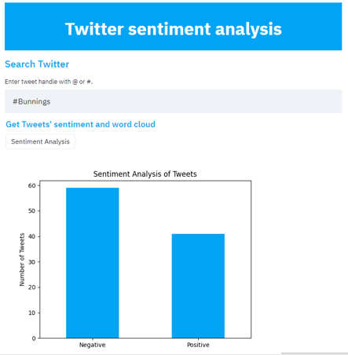
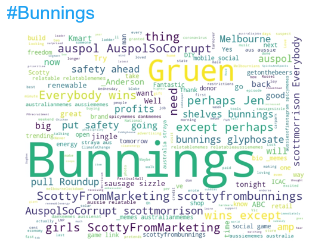
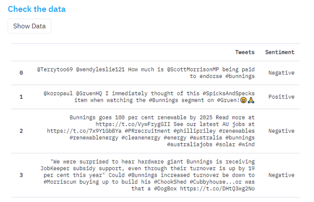

# Twitter Sentiment_Analysis #
### A machine learning model giving the sentiment of Tweets deployed in a web application. ###

[Twitter Sentiment Analysis](https://twitter-sentim-analysis.herokuapp.com/)

** Project Summary: **
1. The problem
Social media platforms are essential for businesses to reinforce their brand and connect with their followers and build their community.
Social media platforms like Twitter provide analytics on the performance of your tweets and how to improve their engagement.
However you don’t have a clear picture on tweets mentioning your brand. 
2. Our solution
The Twitter sentiment analysis app is designed to provide insights on tweets mentioning your brand with # or @.

### How to read the code: ###

The repository contains the following folders:
- Model folder: Jupyter notebook training the Recurrent Neural Network model which is saved under the name "tweeter_ml_trained_1.6.h5".
Please note the dataset I used is not in the repository due to the size of the file. However you can access it on [Kaggle](https://www.kaggle.com/kazanova/sentiment140)
- Presentation folder contains the Powerpoint presentation.
- img contains images
   
The other files:
- app.py is the app. It is run by streamlit. So to run it you have to enter: streamlit runs app.py (instead of python app.py)
- config_1.py with keys
- Procfile, nltk.txt, and setup.sh for Heroku deployment configurations
- requirements.txt with all the requirements needed to run the app.

### The infrastructure used to build our app: ###

### The app: ###

**The sentiment analysis:**

**Word Cloud:**

**The Tweets in table**

